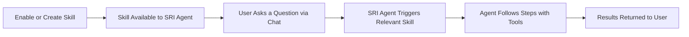

# Agent Skills: Programmable Intelligence for Your Platform

**Agent Skills** are structured, reusable instructions that give RubixKube's **SRI Agent** specialized capabilities and domain expertise. Instead of relying on generic AI reasoning, skills transform operational runbooks into executable workflows that the agent can follow step by step — consistently and predictably.

<Info>
<strong>Think of it like this:</strong> A runbook tells a human engineer what to do. An Agent Skill tells an AI agent what to do — in the same structured way, but executable at machine speed, 24/7, without fatigue or forgotten steps.
</Info>

---

## What Are Agent Skills?

Agent Skills are packaged instructions that define **how** an agent should approach a specific task. Each skill includes:

- **A clear description** of the skill's purpose and scope
- **Allowed tools** the agent can use during execution
- **Step-by-step instructions** that guide the agent's workflow
- **Domain expertise** encoded as structured knowledge

Skills follow the open [Agent Skills](https://agentskills.io/home) format — the same standard used by **Cursor, Claude Code, GitHub Copilot**, and other leading AI coding tools. This means skills are portable, community-driven, and built on an industry-wide specification.

<Tip>
You can enable skills from RubixKube's **system catalog** or create your own custom skills tailored to your infrastructure and workflows.
</Tip>

---

## Why Agent Skills Matter

### The Problem: Runbooks Gather Dust

Every operations team has runbooks — documentation that describes how to handle incidents, perform maintenance, or troubleshoot issues. But traditional runbooks have critical limitations:

- **They're passive documents** — someone has to read and follow them manually
- **They get outdated** — the infrastructure evolves, but the docs don't always keep up
- **They're inconsistent** — different engineers interpret and execute them differently
- **They're slow** — reading, understanding, and executing takes precious minutes during incidents

### The Solution: Runbooks, Now Executable

Agent Skills transform runbooks from static documentation into **structured workflows that RubixKube's [Agent Mesh](/concepts/agent-mesh) can follow step by step**. Operations become:

<CardGroup cols={2}>
  <Card title="More Predictable" icon="bullseye">
    Skills define exact steps, tools, and decision points. Every execution follows the same proven path — eliminating human variability.
  </Card>

  <Card title="Reusable Expertise" icon="recycle">
    Capture your best engineer's knowledge once and replay it across every incident. Expertise scales without scaling your team.
  </Card>

  <Card title="Consistent Execution" icon="check-double">
    Whether it's 2 PM or 2 AM, skills execute identically. No steps skipped, no context lost, no fatigue-driven mistakes.
  </Card>

  <Card title="Continuously Improving" icon="arrow-trend-up">
    Skills evolve with your infrastructure. Update a skill once, and every future execution benefits immediately.
  </Card>
</CardGroup>

---

## From Documentation to Execution

Here's how a traditional runbook becomes an executable Agent Skill:

<Steps>
  <Step title="Traditional Runbook (Before)">
    ```
    Kubernetes Cluster Triage Runbook
    ─────────────────────────────────
    1. Check overall cluster health
    2. Look for pods in error states
    3. Review recent events for anomalies
    4. Examine resource utilization
    5. Collect logs from unhealthy pods
    6. Analyze metrics for trends
    7. Document findings and escalate
    ```
    
    A static document. Someone has to read it, remember each step, and manually run the right commands.
  </Step>

  <Step title="Agent Skill (After)">
    ```yaml
    kubernetes-cluster-triage
    ├── system skill · sre-agent · v1
    │
    ├── DESCRIPTION
    │   Performs a systematic health check and triage of a
    │   Kubernetes cluster by analyzing infrastructure,
    │   identifying unhealthy resources, and gathering
    │   detailed diagnostics including events, logs,
    │   and metrics.
    │
    ├── ALLOWED TOOLS
    │   fetch_infrastructure_snapshot
    │   fetch_kubernetes_graph_snapshot
    │   analyze_kubernetes_resources
    │   kubectl_describe_tool
    │   fetch_kubernetes_logs
    │   fetch_kubernetes_metrics
    │
    └── INSTRUCTIONS
        Step 1: Obtain High-Level Cluster Overview
        Step 2: Identify Unhealthy Resources
        Step 3: Deep-Dive Diagnostics
        Step 4: Correlate Events and Metrics
        Step 5: Generate Triage Report
    ```
    
    A structured workflow. The agent knows exactly which tools to use, in what order, and what to look for.
  </Step>
</Steps>

<Tip>
<strong>Same knowledge, radically different execution.</strong> The skill encodes the same expertise as the runbook — but now an agent can execute it autonomously in seconds rather than minutes.
</Tip>

---

## How Skills Work in RubixKube

### Skill Lifecycle



<Steps>
  <Step title="Enable or Create">
    Navigate to the **Skills** page in the RubixKube Console. Choose from the **system skill catalog** or create your own custom skills. Custom skills are tenant-scoped — they belong to your organization and reflect your operational playbooks.
  </Step>

  <Step title="Available to the SRI Agent">
    Once enabled, skills are loaded by the **SRI Agent** — RubixKube's conversational AI interface. Currently, the SRI Agent is the only agent available for skill assignment.
  </Step>

  <Step title="Triggered Through Chat">
    When you ask a question or describe an incident through RubixKube **Chat**, the SRI Agent automatically determines if any enabled skill is relevant. If a match is found, the agent activates the skill and follows its structured instructions — using only the allowed tools, working through each step methodically.

    For example, asking _"What's wrong with my cluster?"_ or _"Triage the production namespace"_ would trigger the **kubernetes-cluster-triage** skill.
  </Step>

  <Step title="Results Returned">
    The SRI Agent returns structured results directly in your Chat conversation — complete with findings, evidence, and recommendations.
  </Step>
</Steps>

---

### Skill Anatomy

Every Agent Skill is defined by a set of structured fields:

| Field | Purpose |
|-------|---------|
| **Name** | Unique identifier (e.g., `kubernetes-cluster-triage`) |
| **Description** | What the skill does and when to use it |
| **Allowed Tools** | Specific tools the agent can invoke during this skill |
| **Instructions** | Step-by-step workflow the agent follows |
| **Version** | Tracks skill evolution over time |
| **Scope** | `system` (global catalog) or `tenant` (your custom skills) |

---

## Types of Skills

<CardGroup cols={2}>
  <Card title="System Skills" icon="cubes">
    **Pre-built by RubixKube**
    - Available in the system catalog
    - Maintained and updated by the RubixKube team
    - Examples: `kubernetes-cluster-triage`, `linear-tickets-to-notion`, `research-devops-sre-infra`, `debug-linear-incident`
  </Card>

  <Card title="Custom Skills" icon="wand-magic-sparkles">
    **Created by your team**
    - Tailored to your infrastructure and workflows
    - Tenant-scoped for organizational privacy
    - Built using the open Agent Skills format
    - Create from scratch or use a system skill as a template
  </Card>
</CardGroup>

---

## Why Agent Skills in RubixKube?

RubixKube's **Agent Mesh architecture** makes skills uniquely powerful. While other platforms treat skills as simple prompt injections, RubixKube's approach is fundamentally different:

### Mesh-Native Intelligence

Skills aren't just instructions — they're first-class citizens in the [Agent Mesh](/concepts/agent-mesh). The **SRI Agent** loads enabled skills at runtime, giving it domain-specific expertise that goes far beyond generic AI reasoning.

### Tool-Aware Execution

Each skill declares its **allowed tools** explicitly. This means:
- **Security** — agents can only use approved tools, preventing unintended actions
- **Auditability** — every tool invocation is logged and traceable
- **Safety** — the blast radius of any skill is bounded by its tool permissions

### Open Standard, No Lock-In

RubixKube uses the open [Agent Skills](https://agentskills.io/home) specification — the same format championed by Anthropic and adopted by leading AI tools. Your skills are portable and interoperable, not locked into a proprietary format.

---

## Example: Kubernetes Cluster Triage Skill

Here's a real skill from RubixKube's system catalog:

```yaml
name: kubernetes-cluster-triage
type: system skill
agent: sre-agent
version: v1

description: >
  Performs a systematic health check and triage of a
  Kubernetes cluster by analyzing infrastructure,
  identifying unhealthy resources, and gathering
  detailed diagnostics including events, logs, and metrics.

allowed_tools:
  - fetch_infrastructure_snapshot
  - fetch_kubernetes_graph_snapshot
  - analyze_kubernetes_resources
  - kubectl_describe_tool
  - fetch_kubernetes_logs
  - fetch_kubernetes_metrics

instructions: |
  Step 1: Obtain High-Level Cluster Overview
    Action: Begin by getting a broad snapshot of the
    entire cluster's state.
    Tool: fetch_infrastructure_snapshot

  Step 2: Analyze Resource Health
    Action: Identify any resources in error, warning,
    or degraded states.
    Tool: analyze_kubernetes_resources

  Step 3: Deep-Dive into Unhealthy Resources
    Action: For each unhealthy resource found, gather
    detailed descriptions and recent events.
    Tool: kubectl_describe_tool

  Step 4: Collect Diagnostic Logs
    Action: Fetch logs from problematic pods and
    containers for error pattern analysis.
    Tool: fetch_kubernetes_logs

  Step 5: Examine Metrics and Trends
    Action: Review resource utilization metrics to
    identify capacity issues or anomalies.
    Tool: fetch_kubernetes_metrics
```

<Info>
This skill transforms a 30-minute manual triage process into a **sub-minute automated investigation** — with more thorough coverage than any human could achieve under pressure.
</Info>

---

## Getting Started with Skills

<Steps>
  <Step title="Open the Skills Page">
    Navigate to **Skills** in the left sidebar of the [RubixKube Console](https://console.rubixkube.ai). You'll see the skill catalog with **System**, **Custom**, **Enabled**, and **Disabled** filter tabs.
  </Step>

  <Step title="Enable System Skills">
    Browse the system catalog — it includes pre-built skills like **kubernetes-cluster-triage**, **linear-tickets-to-notion**, and **research-devops-sre-infra**. Toggle any skill to **Enabled** to make it available to the SRI Agent.
  </Step>

  <Step title="Create Custom Skills">
    Click **"+ New Skill"** in the top-right corner. You can either:
    - **Upload a SKILL.md file** — drag and drop a skill file that follows the open Agent Skills format
    - **Use as template** — start from an existing system skill and customize the name, description, instructions, and allowed tools

    Select **SRI Agent** from the agent dropdown and click **Create skill**.
  </Step>

  <Step title="Ask Questions via Chat">
    Open **Chat** and ask the SRI Agent questions related to your enabled skills. The agent will automatically trigger the relevant skill and follow its structured workflow to produce results.
  </Step>
</Steps>

---

## Frequently Asked Questions

<AccordionGroup>
  <Accordion title="Can I create my own skills?">
    **Yes.** RubixKube supports custom, tenant-scoped skills. You can create skills tailored to your infrastructure, internal runbooks, and compliance requirements. Custom skills follow the same open format as system skills.
  </Accordion>

  <Accordion title="What is the Agent Skills format?">
    The [Agent Skills](https://agentskills.io/home) format is an open specification initiated by Anthropic and adopted across the industry. It defines a simple, structured way to package instructions and domain expertise for AI agents. RubixKube natively supports this standard.
  </Accordion>

  <Accordion title="How do skills interact with guardrails?">
    Each skill declares an **allowed tools** list as part of its metadata, which specifies the tools intended for that workflow. The SRI Agent follows the skill's instructions and uses the tools defined in the skill's steps. Learn more about RubixKube's safety approach in [Guardrails](/concepts/guardrails).
  </Accordion>

  <Accordion title="Can the SRI Agent use multiple skills?">
    **Yes.** The SRI Agent can have multiple skills enabled simultaneously. When a query or incident matches a skill's domain, the agent selects the most relevant skill based on the context and follows its structured instructions.
  </Accordion>

  <Accordion title="Are skills portable to other platforms?">
    Because RubixKube uses the open Agent Skills format, skills written for RubixKube are compatible with any platform that supports the standard — including Cursor, Claude Code, and GitHub Copilot. There's no vendor lock-in.
  </Accordion>
</AccordionGroup>

---

## Related Concepts

<CardGroup cols={3}>
  <Card 
    title="Agent Mesh" 
    icon="diagram-project"
    href="/concepts/agent-mesh"
  >
    How agents collaborate in a distributed mesh
  </Card>
  
  <Card 
    title="Memory Engine" 
    icon="database"
    href="/concepts/memory-engine"
  >
    How agents learn and improve over time
  </Card>
  
  <Card 
    title="Guardrails" 
    icon="shield-halved"
    href="/concepts/guardrails"
  >
    Safety mechanisms for autonomous operations
  </Card>
</CardGroup>
